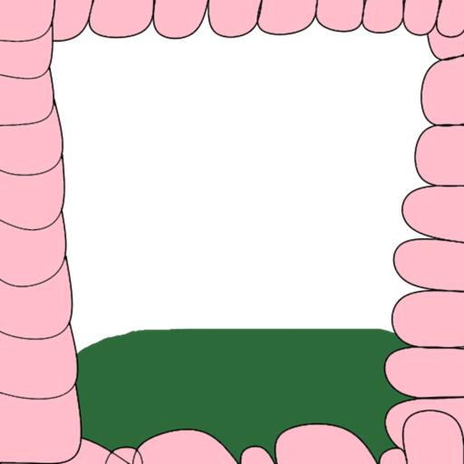

# Discontinued

Due to Seyfert problems, I am discontinuing this version of the Vorasion source code. I will be moving the project to Nx, Angular and NestJS.
Please bear with me, there will be a new repo on the organization.

---

<center>

<h1>Vorasion</h1>
</center>

Welcome to Vorasion, a brand new economy bot that does something most Discord bots never do. Try to be unique (I know, shots fired).

**Most economy bots handle themselves by doing a `/work` -> `/beg` -> `/whatever`** system. **Not Vorasion.** You earn currency by hunting living things and eating them alive.

## Features

- Fully unique
- Two currencies, **Bones** and **Money**
- Character system
- Immersive role play potential

## Warning

This bot is in development (currently Alpha), so it's still being heavily developed. Stuff can change over time. Also... this bot does target **fetish material** (vore, in particular) but uses language that stays suitable for general audiences (really anyone who's **ALLOWED** to be on Discord in the first place). Keep that in mind.

## Inviting

You can invite Vorasion using [this link](https://discord.com/oauth2/authorize?client_id=1475307378613293209&scope=bot%20applications.commands&permissions=4504134418287616&integration_type=0). Keep in mind all permissions are asked for, for a reason.

Some people may ask why Manage Threads is used and required for `/economy eat`, this is because it's used to clean up the private threads once the minigame is over. Without it, there will be useless threads.

## Running Locally

### Prerequisites

- A bot on the [Discord Developer Portal](https://discord.com/developers/applications)
- [Bun](https://bun.sh)
- [Git](https://git-scm.com)
- A local PostgreSQL database (not needed if using Docker)
- [Docker](https://docker.com) (optional, easier way to start the database)

### First Steps

Start by cloning the repository and heading into it.

```sh
git clone https://github.com/Vorasion-Development/Vorasion
cd Vorasion
```

Next, you'll need to install the dependencies. While still in the bot directory, run this.

```sh
bun install
```

This shouldn't take long. You'll then want to bring the database online. Run this next.

```sh
docker compose up -d # Runs detached from the shell. Otherwise once the database starts, your terminal would be full of database logs.
```

Next, run the setup script.

#### Unix (MacOS/Linux)

```sh
bun setup
```

Now, open the generated `.env` file in your favorite text/code editor and set `TOKEN` to the token of the bot on the developer portal.

### Final Steps

With the dependencies installed and the other prerequisites complete, you'll want to do just a couple more things.
First, make sure MikroORM can connect to the database by running the `debug` command.

```sh
bun mikro-orm debug
```

It'll log a bunch of stuff, but you should at least see `database connection successful`. If you see something along the lines of `database connection failed`, the database probably isn't online.

With the database online, push all the migrations to the database so its fully up-to-date.

```sh
bun mikro-orm migration:up
```

You should be done now and can bring the bot online!

```sh
bun start
```

**Made with ❤️ by Vorasion Development (LunaraDev/DumaraWhiteBelly).**

---

## Created with

- Seyfert (no link allowed here, for _[reasons](https://gist.github.com/lunaradev1/6bb5120dad4767c31cb7dcfabfeb1469)_)
- [MikroORM](https://mikro-orm.io/)
- [TypeScript](https://www.typescriptlang.org/)
